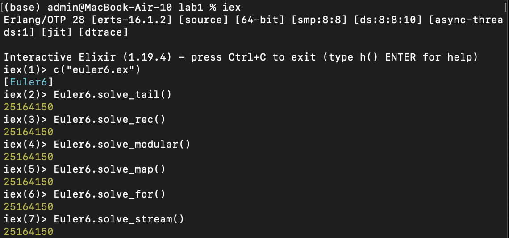
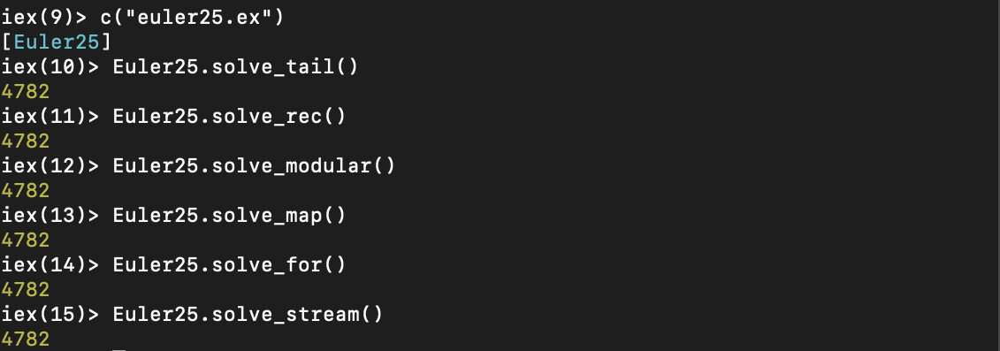
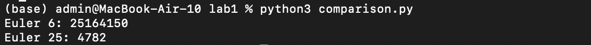

# Отчёт по лабораторной работе по функциональному программированию

## Титульный лист
Студент: Юрисов Всеволод Евгеньевич  
Работа: Лабораторная №1  
Проект: Project Euler  
Вариант: 6, 25  
Язык: Elixir  

---

## Цель работы
Освоить базовые приёмы функционального программирования:
рекурсию, хвостовую рекурсию, отображение (map), свёртку (reduce/fold),
работу с ленивыми последовательностями (Stream).

---

## Описание задач

### Задача 6 (Project Euler)
Требуется найти разность между квадратом суммы и суммой квадратов
первых 100 натуральных чисел:
\[
(\sum_{i=1}^{100} i)^2 - \sum_{i=1}^{100} i^2
\]

### Проверка задачи 6 (Elixir)

---

### Задача 25 (Project Euler)
Требуется определить номер первого числа Фибоначчи,
содержащего не менее 1000 десятичных цифр.
Последовательность задаётся рекуррентно:
F₁ = 1, F₂ = 1, Fₙ = Fₙ₋₁ + Fₙ₋₂.

### Проверка задачи 25 (Elixir)

---

## Реализация
Для каждой задачи были реализованы различные стили функционального программирования:
- хвостовая рекурсия;
- обычная рекурсия;
- модульный стиль с использованием `map`, `filter`, `reduce`;
- отображение (map);
- использование специального синтаксиса циклов (`for`);
- работа с ленивыми последовательностями (`Stream`).

### Сравнение с императивной реализацией (Python)

Полный исходный код приведён в файлах `euler6.ex` и `euler25.ex`.

---

## Выводы
В ходе выполнения лабораторной работы были изучены основные приёмы
функционального программирования на языке Elixir.
Хвостовая рекурсия позволяет реализовывать эффективные вычисления без
переполнения стека, а использование `Stream` даёт возможность работать
с ленивыми и потенциально бесконечными последовательностями.

